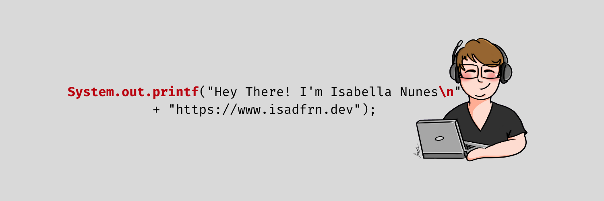

## 

### 👨🏻‍💻 About Me

💡 Software Engineer who likes Algorithms, Data Structures, Linux, Open Source projects, and teaching code.\
🎓 Computer Science bachelor from Federal University of Goiás.\
🌱 Currently learning more about SRE and, DevOps.\
✉️ You can shoot me an [email](mailto:isadfrn@gmail.com) and I'll try to respond as soon as I can.\
📄 Please have a look at my [cv](https://github.com/isadfrn/curriculum/blob/main/isabella-nunes-cv-en.pdf) for more details about me.

### ⚙️ GitHub Analytics

### 🤝🏻 Connect with Me

